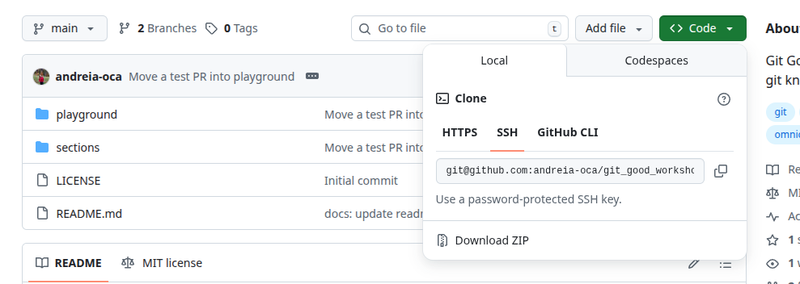

# Set the keys - Set up your ssh keys in GitHub

Working with Git over SSH allows you to authenticate securely without using and create an access token.

Follow this [GitHub tutorial to configure a ssh key](https://docs.github.com/en/authentication/connecting-to-github-with-ssh/adding-a-new-ssh-key-to-your-github-account) on your machine to generate and set a pair of SSH keys in GitHub to enable passwordless access.

Note 01 - Once your SSH keys are configured, make sure to clone repositories using the SSH URL instead of HTTPS.

```bash
git clone git@github.com:andreia-oca/git_good_workshop.git
```



Note 02 - If you’ve already cloned the repository using HTTPS, you don’t need to re-clone it. You can update the remote URL to SSH with the following command:

```bash
git remote set-url origin git@github.com:andreia-oca/git_good_workshop.git
git remote -v
```

[Guidelines and docs](../section/08-advanced-settings.md)
f
